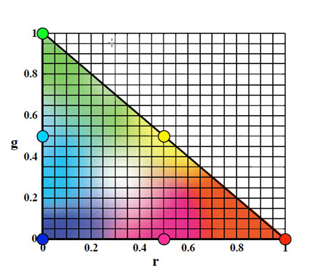

# typescript-training-playground

[Edit on StackBlitz ⚡️](https://stackblitz.com/edit/typescript-training-playground)

## Introduction

There are multiple ways to specify a color in CSS:

- hex: `#f0f0f0`
- red, green, blue: `rgb(127, 127, 127)`
- hue, saturation, lightness: `hsl(200, 80%, 92%)`

(There is also alpha channel, but that will be ignored for this activity.)

1. Add a class to the color-models folder in separate TS files for each of the ways to represent a color:

   - HEX
   - RGB
   - HSL

2. Add a method to each class that will output a CSS color. Consider using a string template.

3. Add a method to each class that validates whether the color is valid.

Now that we can represent colors in different ways, what does the algorithm look like to add two colors together? Let's start with the three colors that make up all of the Daktronics full-color displays: red, green, and blue.

4. Create RGB representations of these color:
   
   - red
   - green
   - blue

5. Write a function that computes the sum of those colors:

   - red and green
   - green and blue
   - blue and red
   - red and green and blue

The hex and rgb formats are explicit about the common components of CSS colors and visible light: red, green, and blue.
A color can be represented as a combination: 

`C = rR + gG + bB` where `r`, `g`, and `b` are the intensities of red, green, and blue.

The total intensity of the color is then `I = r + g + b`.

If we normalize the intensity (i.e. make it equal to 1), then `r`, `g`, and `b` are the fractions of red, green, and blue in the color.
For example, the named CSS color "salmon" is `rgb(250, 128, 114)`. The total intensity of this color is `250 + 128 + 114 = 492`. The color fractions are:

```math
r = 250/492 ≈ 0.5081
g = 128/492 ≈ 0.2602
b = 114/492 ≈ 0.2317
```

So about 51% red, 26% green, and 23% blue at an intensity of 64% (`492/765 * 100`) will produce the salmon color.

This way of looking at colors produces the color triangle:



The fraction of red is on the horizontal axis and the fraction of green is on the vertical axis. The blue component of a color is calculated from the rule that all three fractions add up to 1. This means that any color falls within the triangle bounded by the x-axis, y-axis, and the line `1 - x`.

When adding two colors together, the resulting color is found by drawing a line between the two points for those colors. Where along the line to find the sum depends on the ratio of the original colors - more of one color means the sum is closer to that color than the other.
